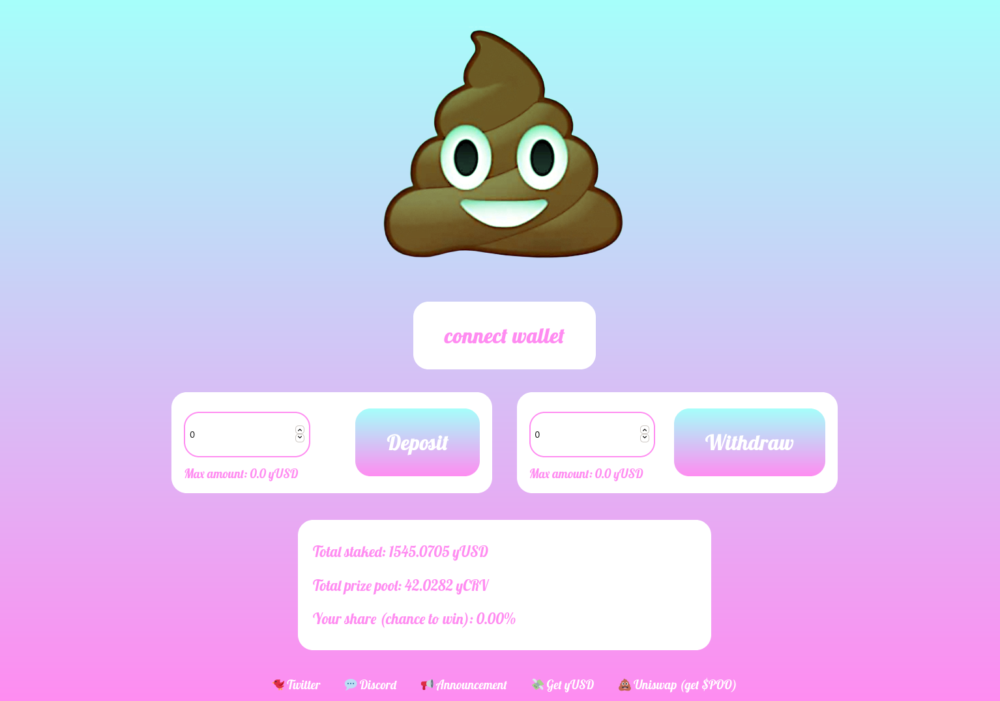

## PooTogether

### Intro: https://pootogether.medium.com/introducing-pootogether-a-no-loss-blockchain-lottery-5959dc820c9

PooTogether is a zero-loss blockchain lottery that works by generating interest (via yearn.finance) on all funds, then using the yield to buy a random shitcoin and send it to a winner periodically.

You can enjoy it on [pootogether.com](https://www.pootogether.com) and it currently only works with yUSD.

For more info, please read [the announcement](https://pootogether.medium.com/introducing-pootogether-a-no-loss-blockchain-lottery-5959dc820c9).

### Building/running

* for the UI, see [the README](./pootogether-ui/README.md)
* for the contracts, `npm install`, `truffle build`, `truffle run`, etc.

### Project status

More or less complete in a basic form - you can find smart contracts and UI in this repo.

Here are the official smart contract addresses:

* POO token: https://etherscan.io/address/0x6A54EF1680f593574522422f3700194EC91CE57d#code
* PooTogether contract: https://etherscan.io/address/0x19a62938f67F2A44C47975Cc4c1132B7B75Aab76#code
* Distributor, this will get changed: https://etherscan.io/address/0x54340e60d02518da2d22fc12da489f944716aa49#code
* Uniswap: https://info.uniswap.org/pair/0x12c740bc4f0c99912ff8bef028270e2fb23adead

Official links: 
* Twitter: https://twitter.com/pootogether
* Discord: https://discord.gg/AaNay4aGkr
 

### Future plans

With the Ethereum congestion, our future plans are changing

Instead of doing another airdrop and starting to do regular draws, we are exploring alternative layer 2 options since reward draws are currently more expensive than the rewards themselves.

### Audits

See https://twitter.com/pootogether/status/1333482399456518144?s=20

### Screenshots

